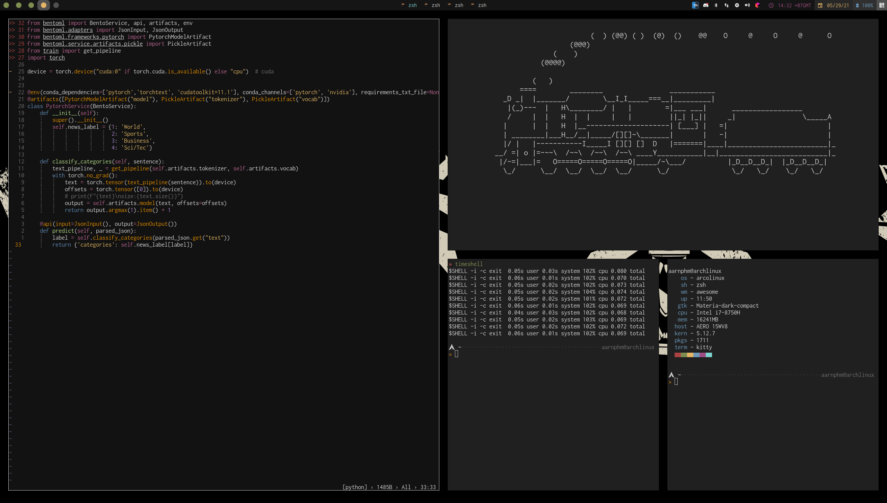

<h1 align="center">dots.</h1>

<div align="center"><p>automated deployment for <code>!~</code> across Unix-based system.</p></div>



- managed with [chezmoi](https://www.chezmoi.io/) 
- secrets stored with [BitWarden CLI](https://bitwarden.com/) and [Unix pass](https://www.passwordstore.org/)
- I have included a Docker version of my dotfiles if you want to try it out.

# Installation

```sh 
    $ curl -fsSL https://raw.githubusercontent.com/aarnphm/dotfiles/HEAD/install | bash
```
- setup `$ZDOTDIR=$HOME/.zsh` in either `/etc/zsh/zshenv` or `/etc/zshenv`

<h3 align="center">Scripts descriptions</h3>

- [run_once_0001_install_pkgman.sh](./run_once_0001_install_pkgman.sh.tmpl) will install either `brew` or `yay` depending on OS defined by `.chezmoi.os`
- [run_once_0002_install_deps.sh](./run_once_0002_install_deps.sh.tmpl) will install my dependencies for day to day uses
- [run_once_0003_install_services.sh](./run_once_0003_install_services.sh.tmpl) will initialise some services using either Mac's services or `systemd`
- [run_once_0004_install_frameworks.sh](./run_once_0004_install_frameworks.sh.tmpl) will install some packages like pyenv, gcloud, etc
- [run_once_0009_sys_default.sh](./run_once_0009_sys_defaults.sh.tmpl) will setup some hacker defaults
